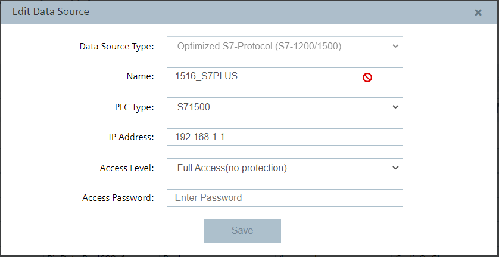
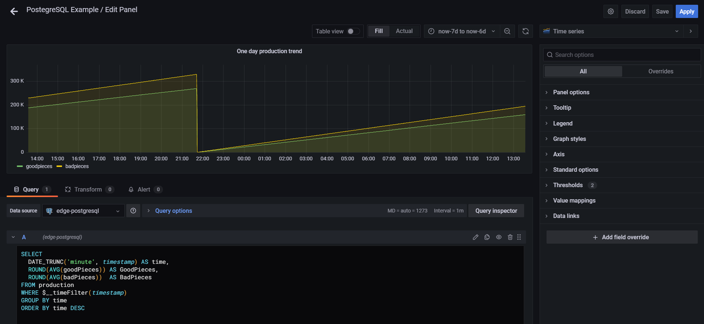
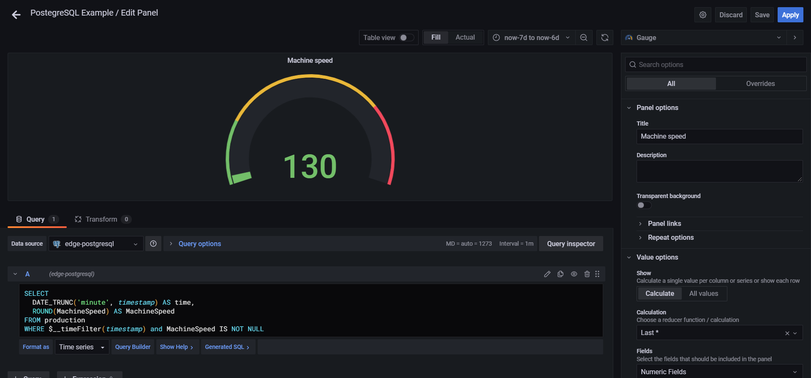
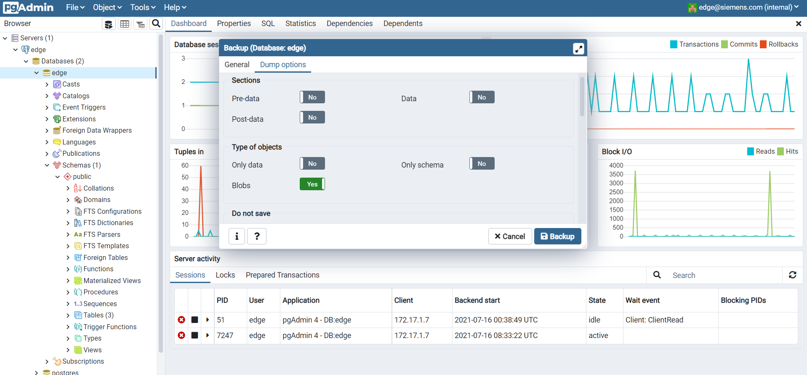

# edge-postgresql
PostgreSQL application example for SIEMENS Industrial Edge.

- [edge-postgresql](#edge-postgresql)
  - [Introduction](#introduction)
    - [Before starting](#before-starting)
  - [Requirements](#requirements)
    - [Used components](#used-components)
    - [Hardware requirements](#hardware-requirements)
    - [Software requirements](#software-requirements)
  - [Installation](#installation)
    - [Download the Application](#download-the-application)
    - [Create new Standalone Application](#create-new-standalone-application)
    - [Upload the Application to Industrial Edge Management](#upload-the-application-to-industrial-edge-management)
      - [Connect your Industrial Edge App Publisher](#connect-your-industrial-edge-app-publisher)
      - [Import a Standalone Application in Industrial Edge Management](#import-a-standalone-application-in-industrial-edge-management)
  - [Usage](#usage)
    - [edge-postgresql](#edge-postgresql-1)
    - [edge-pgAdmin](#edge-pgadmin)
      - [Graphic interface](#graphic-interface)
      - [Creating a new connection to a database server](#creating-a-new-connection-to-a-database-server)
      - [pgAdmin on Edge Device](#pgadmin-on-edge-device)
    - [postgresql-static-server](#postgresql-static-server)
  - [Application example](#application-example)
    - [Description](#description)
    - [Scope of the application](#scope-of-the-application)
    - [Prerequisites](#prerequisites)
    - [Node-RED PostgreSQL node installation](#node-red-postgresql-node-installation)
    - [Configuring data exchange with SIMATIC S7 Connector and IE Databus App](#configuring-data-exchange-with-simatic-s7-connector-and-ie-databus-app)
      - [ConnectionMap creation for Mapping Name Tag - Id Tag](#connectionmap-creation-for-mapping-name-tag---id-tag)
    - [Writing data from IE Databus with MQTT protocol to PostgreSQL database](#writing-data-from-ie-databus-with-mqtt-protocol-to-postgresql-database)
      - [Bulk message receiving from MQTT](#bulk-message-receiving-from-mqtt)
      - [Data pre-processing for PostgreSQL](#data-pre-processing-for-postgresql)
      - [Batch data series buffer](#batch-data-series-buffer)
      - [Sending data to PostgreSQL](#sending-data-to-postgresql)
      - [Data retention and automated deletion of data from the database](#data-retention-and-automated-deletion-of-data-from-the-database)
      - [Data reading from dedicated PostgreSQL database with time filter and conditional filter](#data-reading-from-dedicated-postgresql-database-with-time-filter-and-conditional-filter)
      - [Dashboard for displaying results with SIMATIC Flow Creator](#dashboard-for-displaying-results-with-simatic-flow-creator)
      - [Data visualization dashboard with Grafana](#data-visualization-dashboard-with-grafana)
    - [Backup/restore of PostgreSQL database using Static Server](#backuprestore-of-postgresql-database-using-static-server)
      - [Backup](#backup)
      - [Download the backup file from Application Volumes](#download-the-backup-file-from-application-volumes)
      - [File upload via Postgres Static Server](#file-upload-via-postgres-static-server)
      - [Restore](#restore)
  - [Documentation](#documentation)

## Introduction 
The **edge-postgresql** application allows you to manage **Object-Relational Databases (ORDs)** directly on Edge Devices, not only in terms of building and managing a database, but also in terms of backups and restores of data previously stored locally.

As shown in the figure below, the application consists of three different microservices, described in details in the next paragraphs:
* edge-postgresql
* edge-pgadmin
* postgresql-static-server


### Before starting
This guide describes how to use and install and use the edge-postgresql application.

Before proceeding with the app installation, consult the necessary requirements in paragraph [Requirements](#requirements). Details on the procedure to follow for installing the app on an Edge Device are available in [Installation](#installation) paragraph.

For all the details regarding the use of pgAdmin and Postgres Static Server apps, see chapter [Usage](#usage) and chapter [Documentation](#documentation) for online references and support.

The edge-postgresql application is supplied together with an application example (paragraph [Application example](#application-example)), which shows how to manage a data flow with **PostgreSQL database** through the **SIMATIC Flow Creator** app (based on Node-RED) and the dedicated node [**node-red-contrib-postgres-variable**](https://flows.nodered.org/node/node-red-contrib-postgres-variable). 

The application example also provides an explanation on how to view the read data via the SIMATIC Flow Creator dashboard and via a dedicated dashboard within the **Grafana** application.

For more information on how to install the Node-RED node dedicated to PostgreSQL, see paragraph [Node-RED PostgreSQL node installation](#nodered-postgresql-node-installation).

The section [Build](#build) shows instead details on how this application was built by the mean of **Docker** environment.

## Requirements
### Used components
* OS: Windows or Linux
* Docker minimum V18.09
* Docker Compose V2.0 – V2.4
* Industrial Edge App Publisher (IEAP) V1.2.8
* Industrial Edge Management (IEM) V1.2.16
* Industrial Edge Device (IED) V1.2.0-56

### Hardware requirements
* The edge-postgresql application is only compatible with SIEMENS devices that have **Industrial Edge** functionality enabled.

### Software requirements
* The edge-postgresql application needs **1430 MB** of RAM to run, divided between the different microservices as follows:

| **Service name**	       | **Memory limit** |
|	-------------------------|-----------------:|
| edge-postgresql          |	        1024 MB |
|	edge-pgadmin	           |           256 MB |
|	postgresql-static-server |	         150 MB |
   
> **Note:** These limits have been set for an average data volume in PostgreSQL database and to ensure a constant average usage of dashboards, tasks and other functions, but they can be modified according to specific needs by acting on the docker-compose file and then on the app configuration in the **Industrial Edge App Publisher** software, creating a custom version of this application.

## Installation

The edge-postgresql application comes with the pre-built **edge-postgresql_x.x.x.app** app package (based on the supplied version x.x.x), which can be installed specifically on Edge Devices using SIMATIC Edge.

Below are shown the steps required to download the pre-compiled app or to create and install the edge application starting from the source code here provided.
Please refer to [Documentation](#documentation) for detailed information about Industrial Edge App Development.

In order to install the application, the following prerequisites need to be fullfilled:
* An **Edge Device** correctly configured and onboarded on an accessible **Industrial Edge Management (IEM)** system.
* **Industrial Edge App Publisher** software, downloadable from **IE Hub**.
* Connection to a **Docker Engine**.

### Download the Application

The edge-postgresql app can be downloaded in **.app** format using this secure Google Drive link: [edge-postgresql_0.2.1.app](https://drive.google.com/file/d/1gynAWrlHHsG8cX1d_wTP5K1jBU9AyyKL/view?usp=sharing)

### Create new Standalone Application

* Open the Industrial Edge App Publisher.
* Go to `Standalone Applications` section.
* Import the [docker-compose](docker-compose.yaml) file using the `Import YAML` button.
* Click on `Review` and `Validate & Create`.

### Upload the Application to Industrial Edge Management

This paragraph provides a short description on how to publish the application in your IEM. For more detailed information please see the official Industrial Edge GitHub guide for [uploading apps to the IEM](https://github.com/industrial-edge/upload-app-to-industrial-edge-management).

#### Connect your Industrial Edge App Publisher

* Connect your Industrial Edge App Publisher to your **Docker engine**.
* Connect your Industrial Edge App Publisher to your **Industrial Edge Management**.

#### Import a Standalone Application in Industrial Edge Management

* Create a new Project in the connected IEM or select an existing one.
* Import the standalone application created [above](#create-new-standalone-application) to the selected IEM Project.
* Press `Start Upload` to transfer the app to Industrial Edge Management.

Further information on how to use the Industrial Edge App Publisher can be found in the [IE Hub](https://iehub.eu1.edge.siemens.cloud/documents/appPublisher/en/start.html).

## Usage

As anticipated in [Introduction](#introduction) paragraph, the edge-postgresql application consists of three different services:
* **edge-postgresql**
* **edge-pgadmin**
* **postgresql-static-server**

### edge-postgresql

**PostgreSQL** is an **Object Database Management System (ODMS)** that supports most of the SQL standard, with features such as:
* Complex queries;
* Foreign keys;
* Functions and procedures;
* Views;
* Trigger;
* Integrity of transitions.

PostgreSQL uses a **client / server model**, thus managing a session through two cooperative processes:
* A server process (*postgres*), which manages database files and accepts simultaneous database connections from one or more client applications, performing actions on the database on behalf of clients.
* The client (*front-end*) application of the user who wants to perform database operations.

Client and server can be located on different hosts and will communicate, in this case, via a TCP/IP network connection.

Thanks to its license, PostgreSQL can be freely of charge used, modified and distributed by anyone for any purpose: private, commercial or academic.

For more information on PostgreSQL, please visit: https://www.postgresql.org/

### edge-pgAdmin

**pgAdmin** is an **opensource front-end**, compatible with Linux, Windows, Solaris and Mac OSX, featuring a graphical interface that allows to easily administer PostgreSQL databases.

The application supports all the features typical of the PostgreSQL database, from writing simple SQL queries to the development of complex databases. It is addressed to both administrators and users of the database, integrating the management of permissions taken from the PostgreSQL database.

Through pgAdmin it is possible to create a new database from scratch and to access data entry functions for the database population, such as queries, functions or procedures, by using the SQL language.

For more information on pgAdmin go to https://www.pgadmin.org/

#### Graphic interface

When opened, the graphical interface of pgAdmin has a bar at the top and a window divided into two distinct panels. The top bar allows you to access different operating menus, and to view the user logged into the application. The left panel shows a navigation tree within all the available server connections and databases.

The panel on the right, instead, shows some tabs that allow to:
* Configure new database server connections;
* Configure and customize the pgAdmin interface;
* Access online documentation, PostgreSQL website or support community.


#### Creating a new connection to a database server

To configure a new connection within pgAdmin, you must first specify the connection name or description. The chosen name will then be displayed in the connections navigation tree, on the left hand side panel of pgAdmin web interface.

In addition to the connection name, also the following parameters can be  specified:
* Membership group of the configured server: the configured server will be visible in the navigation tree under the parent node or membership group specified;
* Server background and foreground colors;
* If direct connection to the server upon completion and closure of the dialog box is needed;
* Possibility of sharing the server with other users;
* Comments.


Once this information has been specified, it is then necessary to indicate in the `Host name/address field`, the IP address of the server host or the complete domain name of the server. Instead, the server host listener port is defined in the `Port` field, and its default value is `5432`.

Finally, it is necessary to specify the user and password (and the privileges of the user in `Role` field) that will be used when authenticating to the server.


The following paragraph will indicate the server configuration used in the application example provided.

For more in-depth information on the fields not mentioned, please visit https://www.pgadmin.org/docs/pgadmin4/5.6/server_dialog.html

#### pgAdmin on Edge Device

The pgAdmin web page is accessible at `http://[core-name]:35433`, or simply by clicking on the edge-postgresql icon inside the Edge Device on which the application is installed. To access the application, the user and password are resepcitvely `edge@siemens.com` and `edge`, as configured in [docker-compose](docker-compose.yaml) file by the following environment variables:

      PGADMIN_DEFAULT_EMAIL: edge@siemens.com
      PGADMIN_DEFAULT_PASSWORD: edge


The edge-postgresql application comes with a **pre-loaded database** called **edge**. The edge server database connection configurations are the following:

<p align="center">

</p>

### postgresql-static-server

**Postgres Static Server** is an **API application** characterized by a graphical interface that allows the **upload of backup files** saved locally on your PC, with the aim of using these files to restore a database or specific database objects.

The graphic interface of the application consists of three main sections:
1. **Path**: section for selecting the path where the database backup file will be saved. The path chosen defines the user to whom the uploaded backup file will be visible in pgAdmin. The drop-down menu for this section is automatically filled in with users who have logged in at least once in pgAdmin.
2. **File**: section for uploading files through drag & drop or by selecting the file from the explorer of your PC. There is no limit to the size of the uploadable file.
3. **Backup files list** and **Delete static files**: list of all uploaded files, together with a function to delete all files saved within the path indicated *Path* section. Once the files have been deleted, they will no longer be visible or usable in pgAdmin.


The Postgres Static Server web page is accessible at `http://[core-name]:35434`.

## Application example
### Description
The use of a database allows to create a **structured data archive** in which to save medium-long term data, and then act on the collected data for activities such as the visualization or analysis of historical data, with the aim of obtaining relevant information.

If designed correctly, a database can in fact allow the **structuring of heterogeneous data**, ensuring the accuracy and integrity of the information saved and facilitating the search or subsequent processing of the data itself. 

In this application example it will be shown how to use PostgreSQL to implement an effective **data collection** and how to **graph the collected data** through multiple viewing modes. 

An additional functionality described will be on how to perform **backup/restore of PostgreSQL databases** or single objects within a database (tables, procedures, functions, etc.), with the aim of using the backup files as a restore copu on different Edge Devices. This will help facilitating the replicability and scalability of the database related to a use case on multiple devices, depending on the different needs.

### Scope of the application

The aim of this application example is to implement various functionalities:

* Configuration of data exchange with SIMATIC S7 Connector and IE Databus apps;
* Writing data from IE Databus with MQTT protocol in a dedicated PostgreSQL database;
* Data retention and automated deletion of data from the PostgreSQL database;
* Dashboard for data visualization with Grafana;
* Data reading from PostgreSQL database with time filter and conditional filter;
* Dashboard for data visualization with SIMATIC Flow Creator;
* Backup/restore of PostgreSQL databases via Postgres Static Server.

### Prerequisites

* To enable communication with an S7 data source, a **PLC** of the SIMATIC family (S7-300, S7-1200. S7-1500,…);
* The **SIMATIC S7 Connector** application must be installed and configured on the edge device used;
* The **SIMATIC IE Databus** application must be installed and configured on the edge device used;
* The **SIMATIC Flow Creator** application must be installed on the Edge Device being used;
* The node **node-red-contrib-postgres-variable** must be installed in the node library of SIMATIC Flow Creator. For more details see chapter [Node-RED PostgreSQL node installation](#nodered-postgresql-node-installation);
* The [Flow_AppExample_S7toPostgreSQL.json](Flow_AppExample_S7toPostgreSQL.json) file must be imported into the SIMATIC Flow Creator application using the `Import` functionality from the dedicated menu;
* The **edge-postgresql** application must be installed on the Edge Device being used. For more details follow chapter [Installation](#installation);
* The edge-postgresql application comes with a **pre-loaded database** called **edge**. This database must necessarily exist for the created Node-RED stream to function properly.

### Node-RED PostgreSQL node installation

> **NOTE** - The installation of additional nodes in the SIMATIC Flow Creator application (based on Node-RED) is permitted, but these nodes are not officially supported by Siemens.

1. Open the `Editor` page of the **SIMATIC Flow Creator** application by clicking on the icon on the Edge Device UI or by using the URL `https://[core name]/sfc-root/`.
2. From the main menu navigate to the submenu `Manage Palette`.


3. Go to the `Install` section
4. Search for the node with the name `node-red-contrib-influxdb` and press the `Install` button to start the installation.


5. When the installation is finished, close the submenu by clicking the `Close` button.
6. If required by the installed node, a **restart** of the SIMATIC Flow Creator application may be necessary.

For more information, please refer to the official documentation of the node [node-red-contrib-postgres-variable](#https://flows.nodered.org/node/node-red-contrib-postgres-variable).

### Configuring data exchange with SIMATIC S7 Connector and IE Databus App

In order to use the PostgreSQL database for saving information, it is first necessary to exchange data with a data source capable of cyclically generating new values.

In this application example, the use of a **SIMATIC S7 PLC** data source is considered, configured within the **SIMATIC S7 Connector** application by entering the properties necessary for the communication and the list of variables to be monitored.

In this case, within the S7 Connector application an **S7-1500 CPU** has been configured as a Datasource with S7 + protocol and with **Bulk Publish** data publishing mode:



**Bulk Publish** mode can be set via the `Settings` button in the S7 Connector configuration interface, together with the user and password used to connect to the MQTT broker of the SIMATIC IE Databus application. 

In this example we will use `edge` user and `edge` password, as can be seen from the images below.


For the purpose of this application example, 3 variables will be considered, summarized in the following table:

| **Datapoint Id**      | **Description**                 |	**S7+ Address**     	| **Type** |**Access Mode**|
|:----------------------|:--------------------------------|:----------------------|:---------|:--------------|
| Production_GoodPieces	| Produces pieces counter             |	Production.GoodPieces	|     Dint | Read          |
| Production_BadPieces	| Discarded pieces counter              |	Production.BadPieces	|     Dint | Read          |
| Production_MachSpeed	| Production speed in pieces/min. |	Production.MachSpeed  |	    Real | Read&Write    |

The result of data source and tags configuration within S7 Connector application is shown in the image below, displaying the `Data Connections` section of the Industrial Edge Management system:


In Bulk Publish mode, when S7 Connector performs a data reading, only one MQTT topic is used where all the variables that have undergone a change of value in the configured cycle time are published (*CyclicOnChange* mode).

The data read from the configured variables will then be available through the SIMATIC IE Databus application using the MQTT topic dedicated to the configured datasource (`1516_S7PLUS` in this example), which will cyclically emit a JSON message containing the `vals` property: an array with all the properties of the variables read.

Below an example of a JSON message obtained from S7 Connector via MQTT when reading the variables:

```bash
{
  "topic": "ie/d/j/simatic/v1/s7c1/dp/r/1516_S7PLUS/default",
  "payload": {
    "seq": 84631,
    "vals": [
     {
        "id": "101",
        "qc": 3,
        "ts": "2021-09-09T16:35:02.124Z",
        "val": 80
      },
      {
        "id": "102",
        "qc": 3,
        "ts": "2021-09-09T16:35:02.124Z",
        "val": 20
      },
      {
        "id": "103",
        "qc": 3,
        "ts": "2021-09-09T16:35:02.124Z",
        "val": 120.5
      }
    ]
  }
}
```

The following table specifies the meaning of the typical properties of the message obtained by S7 Connector through MQTT protocol when reading the variables, with reference to the example message above:

| Property | Description | Example Value |
|----------|-------------|---------------|
| **topic** | mqtt topic of the received message. | ie/d/j/simatic/v1/s7c1/dp/r/1516_S7PLUS/default |
| **payload** | Body of the message, containing all properties populated by S7 Connector. | `{"seq": 84631, "vals": [...] }` |
| **seq** | Progressive number of the read sequence. Each new read increments this number by 1. | 84631 |
| **vals** | Array containing all variables read in a loop and their properties. | `[{"id": "103", "qc": 3, "ts": "2021-09-09T16:35:02.124Z", "val": 120.5}, .... ]` |
| **id** | ID of the variable configured within the S7 Connector app. | 103 |
| **qc** | Quality Code of reading. | 3 |
| **ts** | Timestamp in ISO86901 (yyyy-MM-ddThh:MM:ss) format. |"2021-09-09T16:35:02.124Z" |
| **val** | Value of the variable read. | 120.5 |

For more information on S7 Connector and IE Databus applications, or for more information on how to read variables via MQTT protocol, please consult the dedicated manuals:
* [SIMATIC S7 Connector Operating Manual](https://support.industry.siemens.com/cs/us/en/view/109783783)
* [SIMATIC IE Databus Operating Manual](https://support.industry.siemens.com/cs/us/en/view/109783784)
* [Edge Management Operation Manual](https://support.industry.siemens.com/cs/us/en/view/109793845)

#### ConnectionMap creation for Mapping Name Tag - Id Tag

As described in the previous paragraph, all messages received on the topic data are characterized by three properties: *name* (description of the tag), *id* (unique identification number assigned by the S7 Connector Configurator to each configured tag) and *dataType* (data type of the tag).

The correspondence between *id* and *name* of the various tags is visible within the MQTT message called **metadata**, that S7 Connector Configurator sends to each MQTT client connected to the specified topic (`ie/m/j/simatic/v1/s7c1/dp`) and that is updated every time the data source configuration in S7 Connector is modified.

Below an example of an **MQTT metadata message** received:

```bash
{
  "topic":   "ie/m/j/simatic/v1/s7c1/dp",
  "payload": {
	"seq": 1,
     "connections": [
	  {
	    "name": "1516_S7PLUS",
	    "type":"S7+",
	    "dataPoints": [
		  {
		    "name":        "default",
		    "topic":       "ie/d/j/simatic/v1/s7c1/dp/r/1516_S7PLUS/default",
		    "publishType": "bulk",
		    "dataPointDefinitions": [
		      {
			   "name":     "Production_GoodPieces",
			   "id":       "101",
			   "dataType": "DInt"
			 },
			 {
			   "name":     "Production_BadPieces",
			   "id":       "102",
			   "dataType": "DInt"
			 },
			 {
			   "name":     "Production_MachSpeed",
			   "id":       "103",
			   "dataType": "Real"
			 }
		         ]
	       }
	     ]
	       }
	 ]
    },
    "qos":        2,
    "retain":    true,
    "_msgid":  "6d13e819.8185e8"
}
```

An example of data reading in an **MQTT data message** is the following:

```bash
{
  "topic":  "ie/d/j/simatic/v1/s7c1/dp/r/1516_S7PLUS/default",
  "payload": {
	"seq": 167553,
     "vals": [
       {
         "id":  "101",
         "qc":  3,
         "ts":  "2021-08-30T15:24:05.870Z",
         "val": 115403
       },
       {
         "id":  "102",
         "qc":  3,
         "ts":  "2021-08-30T15:24:05.870Z",
         "val": 478
       },
       {
         "id":  "103",
         "qc":  3,
         "ts":  "2021-08-30T15:24:05.870Z",
         "val": 120.5
       }
    ]
  },
  "qos":    0,
  "retain": false    
  "_msgid": "151f43ab.77230c"
}
```

As visible in the message above, each tag read is identified exclusively by a unique *id*, without any indication of the *name* of the tag configured within the S7 Connector Configurator application. This can make it difficult, during the data reading phase, to recognize the configured tags.

To facilitate the reading and recognition of the configured variables, in the **Flow_AppExample_S7toPostgreSQL.json** file of the application example provided, there is a flow of SIMATIC Flow Creator which, starting from the MQTT metadata message (*mqtt-in* node below), has the aim to map the *id* and *name* of the configured tags.


To do this, the flow uses a function (*function* node - *Create S7 ConnectionMap Variable*) which saves Map type objects within the global variable **S7ConnectionMap**, that are key-value pairs (*id-name* or *name-id* of the tags) sorted according to the insertion order of the various pairs within the variable. The content of the function node is the following:

```bash
//Create an object containing each S7 Connector connection property with different Map Objects to create correspondence between Tags IDs, Names and Types. Initialize the connections Mapping Object.
let S7ConnectionMap = {
    "nameList":[],   // array of available S7 Connections names. Order is the same in Map objects below.
    "typeList":[],   // array of available S7 Connections types. Order is the same of nameList.
    "nameIDMaps":[], // array of Tags Names-IDs object. Order is the same of nameList.
    "IDnameMaps":[], // array of Tags IDs-Names Map object. Order is the same of nameList.
    "IDTypeMaps":[]  // array of Tags IDs-Type Map object. Order is the same of nameList.    
}

//Check Payload
let m = msg.payload;
if (m.seq == undefined) {
    // update global maps
    flow.set("S7ConnectionMap", null);
    // update function node status
    node.status({fill:"red",shape:"ring",text:"S7Map cannot be created"});
    
    return null;
}  

//Iterate through connections
for (let i = 0; i < m.connections.length; i++)
{
    let connection = m.connections[i];
    // push connection name and type in global object
    S7ConnectionMap.nameList.push(connection.name);
    S7ConnectionMap.typeList.push(connection.type);
    // init maps
    let nameIDMap = new Map();
    let IDNameMap = new Map();
    let IDTypeMap = new Map();
    
    // Iterate through dataPoints
    let dataPoints = connection.dataPoints;
    for (let j = 0; j < dataPoints.length; j++)
    {
        let dataPoint = dataPoints[j];
        // Iterate through dataPointDefinitions
        let dataPointDefinitions = dataPoint.dataPointDefinitions;
        for (let k = 0; k < dataPointDefinitions.length; k++)
        {
            let dataPointDefinition = dataPointDefinitions[k];
            // push in maps the datapoint property
            nameIDMap.set(dataPointDefinition.name, dataPointDefinition.id);
            IDNameMap.set(dataPointDefinition.id, dataPointDefinition.name);
            IDTypeMap.set(dataPointDefinition.id, dataPointDefinition.dataType);        
        }
    }
    // push mappings in global object
    S7ConnectionMap.nameIDMaps.push(nameIDMap);
    S7ConnectionMap.IDnameMaps.push(IDNameMap);
    S7ConnectionMap.IDTypeMaps.push(IDTypeMap);
}

// Update global maps
flow.set("S7ConnectionMap", S7ConnectionMap);

// Set S7Map as output payload
msg.payload = S7ConnectionMap;

// Update function node status
node.status({fill:"green",shape:"ring",text:"S7ConnectionMap created for " + S7ConnectionMap.nameList.join()});

return msg;
```

To use the S7ConnectionMap global variable for subsequent processing within a new function node, it is first necessary to extract the S7ConnectionMap global variable and the index relating to the datasource of interest (in this specific case the PLC `1516_S7PLUS`).

```bash
let S7ConnectionMap = flow.get("S7ConnectionMap");
let connectionIndex = S7ConnectionMap.nameList.indexOf("1516_S7PLUS");
```

Once the S7ConnectionMap global variable is available, it is possible to obtain the *name-id* map of the configured tags using the following line of code:

```bash
let nameIDMap = S7ConnectionMap.nameIDMaps[connectionIndex];
```

To obtain instead the *id-name* map of the configured tags:

```bash
let IDNameMap = S7ConnectionMap.IDnameMaps[connectionIndex];
```

The *id* of a specific tag can be extracted from the nameIDMap map starting from its *name*, for example `Production_GoodPieces`. The output of the line of code shown below will be `101`, which is the *id* associated to the tag with *name* `Production_GoodPieces`.

```bash
let tagId = nameIDMap.get("Production_GoodPieces");
```

To obtain instead the *name* of a specific tag starting from its *id*, it will be sufficient to extract it from the IDnameMap map, using the key (id) of interest, for example `101`. The output of the line of code shown below will be `Production_GoodPieces`, that is the *name* associated with the tag with *id* `101`.

```bash
let tagName = IDnameMap.get("101");
```

### Writing data from IE Databus with MQTT protocol to PostgreSQL database

Once the variables to be exchanged with the PLC data source have been configured within the S7 Connector application, the SIMATIC Flow Creator application can be used to collect the data read, process them and send them to the pre-configured PostgreSQL database of the edge-postgresql application, through the flow visible in the image below and supplied together with the application example.


First thing to do, before loading data into the PostgreSQL database, is to create a table within the database that will contain the data read.

In the application example provided, the data read from the PLC data source is loaded into a table called `production` in the PostgreSQL database. This table can be manually created through the pgAdmin user interface, or by using the flow highlighted in red in the figure below.


Upon receipt of a manual trigger by the user on the *inject* node (*Create Table*), the body of the *function* node (*Create table query*) is executed. This function deletes table `production`, if it exists, by means of the **DROP TABLE** statement, and recreates it in the database by means of the **CREATE TABLE** statement.

```bash
DROP TABLE IF EXISTS production;

CREATE TABLE production (
    id SERIAL PRIMARY KEY,
    timestamp TIMESTAMP(3) NOT NULL,
    GoodPieces INTEGER,
    BadPieces INTEGER,
    MachSpeed REAL,
    MachineName VARCHAR(255) NOT NULL
);
```

As visible from the SQL code above, the production table consists of 6 columns:

1. **id**: unique identifier of the record in the table. This column is the primary key of the table and is automatically incremented by 1 when a new record is inserted.
2. **timestamp**: date and time of reading.
3. **GoodPieces**: integer number representing the number of pieces produced.
4. **BadPieces**: integer number representing the number of rejected pieces.
5. **MachSpeed**: real number representing the speed of the machine.
6. **MachineName**: string representing the name of the machine associated with the production.

Within the flow of SIMATIC Flow Creator provided with the application example, the reading of the data from S7 Connector is carried out via an *mqtt-in* node (1), which subsequently sends the message content to a *function* node (2) that processes the data in order to make them compatible with the standard required by *postgres* node (4) which will instead be in charge of sending the request to the pre-configured PostgreSQL database called edge. To optimize the writing load on the database, a *join* node (3) creates a batch of 5 datasets before sending them to the PostgreSQL database.


#### Bulk message receiving from MQTT

Through the *mqtt-in* node (1), Flow Creator connects to the **Broker MQTT IE Databus**, using the topic dedicated to the PLC configured for the purpose, in this example `1516_S7PLUS`:


On the topic indicated in the figure, at each reading cycle, we will receive messages from MQTT IE Databus, containing all the data read by the S7-1500 PLC configured within the S7 Connector application. The name of the configured PLC is part of the topic to be subscribed.

Below an example of the output of the *mqtt-in* node:

```bash
{
  "topic": "ie/d/j/simatic/v1/s7c1/dp/r/1516_S7PLUS/default",
  "payload": {
    "seq": 84631,
    "vals": [
      {
        "id": "101",
        "qc": 3,
        "ts": "2021-03-10T22:23:04.146Z",
        "val": 80
      },
      {
        "id": "102",
        "qc": 3,
        "ts": "2021-03-10T22:23:04.146Z",
        "val": 20
      },
      {
        "id": "103",
        "qc": 3,
        "ts": "2021-03-10T22:23:04.146Z",
        "val": 120.5
      }
    ]
  }
}
```
To connect to the SIMATIC IE Databus MQTT broker, you need to configure a user enabled for data exchange. In this case it was configured using the following parameters:

|**IE Databus Address**|**IE Databus Port**|**IE Databus User**|**IE Databus Password**|
|----------------------|-------------------|-------------------|-----------------------|
ie-databus	|1883	|edge	|edge|

#### Data pre-processing for PostgreSQL

Before being able to save the received data into the PostgreSQL database, it is necessary to properly format the message received by IE Databus via the *mqtt-in* node, according to the specifications required by PostgreSQL standard.

Within the application example provided, two *function* nodes are in charge of formatting the messages received. These two nodes are divided by a *batcher* node, which will be described in details in the following paragraph.

The first *function* (2) node processes the input messages through a Javascript script, and creates one or more output messages. An example of the *function* (2) node output is:

```bash
{
	"payload": "('2021-09-01 19:05:02.339','Demo_Line',74222,92082,262)",
	"_msgid":  "1dc24460.34b41c"
}
```

As can be seen in the payload of the above message, the information provided by the output messages are: timestamp of the reading, machine name, value of tags `Production_GoodPieces`, `Production_BadPieces` and `Production_MachSpeed`.

The message payload is formatted inside the *function* (2) node as a string, where the variables mentioned above are divided by "," and enclosed by "()". This type of formatting will facilitate data writing via INSERT queries into `production` table of PostgreSQL `edge` database.

The content of *function* (2) node is:

```bash
// Insert here the ordered output tag list
let selectedTags = ["Production_GoodPieces", "Production_BadPieces", "Production_MachSpeed"];

// Get S7Map variable
let S7ConnectionMap = flow.get("S7ConnectionMap");

// Find index of fps716 connection
let connectionIndex = S7ConnectionMap.nameList.indexOf("1516_S7PLUS");

// Use the index to get the right map
let nameIDMap = S7ConnectionMap.nameIDMaps[connectionIndex];

// Get IDs of selected Tags
let selectedIDs = selectedTags.map(name => nameIDMap.get(name));

// Create an empty values array
let selectedValues = new Array(selectedTags.length).fill("NULL");

// Initialize timestamp
let timestamp = null;

// Iterate through readed tags
for (let i=0; i < msg.payload.vals.length; i++){

    // Iterate through selected ids
    for(let j=0; j < selectedIDs.length; j++){

        // Search for tag
        if(msg.payload.vals[i].id == selectedIDs[j])
        {
            // Set timestamp
            timestamp = new Date(Date.parse(msg.payload.vals[i].ts)+7200000).toISOString().replace("T", " ").replace("Z", "")
            // Assign message to selected vals
            selectedValues[j] = Number(msg.payload.vals[i].val.toFixed(2));
            // stop on first match, first for will continue on next tag
            break;
        }
    }
}

// Create out message
let outMsg = {};

// If payload contains some values send it
if (timestamp)
{
    // Create values string
    outMsg.payload = "(\'" + timestamp + "\',\'Demo_Line\'," + selectedValues.join(",") + ")";

    return outMsg;
}
```

In the Javascript code shown above, it's visible how the node *function* (2) first defines the tags of interest (`selectedTags`), and then uses the instructions described in paragraph [ConnectionMap creation for Mapping Name Tag - Id Tag](#connectionmap-creation-for-mapping-name-tag---id-tag) to perform the mapping between *id* and *name* of the selected tags. 

In the code, the property *id* of each variable read is compared with the *id* of the selected variables and retrieved through the `S7ConnectionMap` global variable: in case of match, the function will continue with the subsequent instructions.

The output message of the function contains the timestamp (*epoch*) in ms obtained from the `ts` property of each variable read. It will also contain the values ​​of the tags of interest, identified through the `val` property of the read messages, rounded up to 2 decimal digits.

The string `Demo_Line` of the output messages, is instead a fixed parameter that identifies the name of the machine to which the read tags are associated to. This string will correspond to the `machineName` column of database `production` table, and will be filled in with `Demo_Line` for all records entered into the tabel of PostgreSQL database.

The *join* node (3) following the *function* node (2), creates an array that identifies the batch of data to be subsequently inserted into `production` table of PostgreSQL database. The characteristics of this node are explained more in details in paragraph [Batch data series buffer](#batch-data-series-buffer).

As for *function* (4) node, on the other hand, this has the purpose of composing an INSERT query of the data extracted. Below the Javascript script of *function* (4) node.

```bash
// Create out message
let outMsg = {}

// Compose query
let query = 'INSERT INTO production ';
query += '(timestamp, machineName, goodPieces, badPieces, machineSpeed) VALUES';
query += msg.payload;

outMsg.payload = query;

return outMsg;
```

An example of an incoming payload to *function* (4) node is:

```bash
"('2021-09-02 15:36:37.295','Demo_Line',11303,NULL,220),('2021-09-02 15:36:38.299','Demo_Line',11307,NULL,222),
('2021-09-02 15:36:39.303','Demo_Line',11309,13876,224),('2021-09-02 15:36:40.303','Demo_Line',NULL,13880,226),
('2021-09-02 15:36:41.303','Demo_Line',11311,13882,228)"
```

As can be seen from the message above, each payload contains a series of 5 readings in which, for each reading, the timestamp, `machineName`, `goodPieces`, `badPieces` and `machineSpeed` are present.
The node will format the incoming payload into the following query:

```bash
"INSERT INTO production (timestamp, machineName, goodPieces, badPieces, machineSpeed) VALUES 
('2021-09-02 15:36:37.295','Demo_Line',11303,NULL,220),('2021-09-02 15:36:38.299','Demo_Line',11307,NULL,222),
('2021-09-02 15:36:39.303','Demo_Line',11309,13876,224),('2021-09-02 15:36:40.303','Demo_Line',NULL,13880,226),
('2021-09-02 15:36:41.303','Demo_Line',11311,13882,228)"
```

#### Batch data series buffer

The PostgreSQL database can handle high query loads, but it is always good practice to try optimizing the database writing load by collecting a certain amount of data before writing them into the database.

This **data buffering** can easily be created in Flow Creator through a *join* node, capable of joining a series of messages into a single message with characteristics that depends on the different rules and configurations.

In this application example, the *join* node used creates a batch of 5 data series in the form of a string, as shown in the previous paragraph. Once the message counter reaches the limit identified by the configured count property (5 in this case), the *join* node will proceed to send the data batch to PostgreSQL database.

Below the configuration of the *join* node in the Flow Creator flow of the application example provided.


#### Sending data to PostgreSQL

To communicate with the PostgreSQL database it is possible to exploit the PostgreSQL API exposed by PostgreSQL for data exchange. These PostgreSQL APIs are the basis of the Node-RED node [**node-red-contrib-postgres-variable**](https://flows.nodered.org/node/node-red-contrib-postgres-variable), created to write and query data from a PostgreSQL database.

The edge-postgresql application provided includes the `edge-postgresql` service container based on the 13.3-alpine version of PostgreSQL and, as mentioned previously, exposes a pre-defined database named `edge` with pre-configured user and password `edge` / `edge`. 

This application can be contacted by other applications present both on the Edge Device used and by **external networks** connected to the physical ports of the Edge Device thanks to the **port forwarding** functionality offered by the Docker service.
These connection parameters can be entered directly in the configuration of the `Server` parameter of *node-red-contrib-postgres-variable* node:

|**Service Name**|**Host Name**|**Internal Port**|**External Host**|**External Port**|**Database Name**|**User**|**Password**|
|----------------|-------------|-----------------|-----------------|-----------------|-----------------|--------|------------|
edge-postgresql|edge-postgresql|5432|[ied-ip-address] or [ied-dns-name]|35432|edge|edge|edge


Below an image of `production` table, in which the values relating to the read tags are loaded.


#### Data retention and automated deletion of data from the database

It is essential during the design of a database to define the so-called **data retention**, meaning the period of permanence and conservation of the data loaded into the database. 

Depending on the needs, the uploaded data can be deleted after a short, medium or long term stay in the database, after a manual backup of the data itself.

Data retention period is usually dictated by the storage capacity of the hardware used. For hardware with limited storage capacities, it is necessary to guarantee a short or medium-term latency period of data inside the database. Instead, in case of hardware with extended storage capacities, it is possible to increase the data latency period.

In the application example provided there is a flow of SIMATIC Flow Creator which allows the deletion of data loaded into `production` table of the database through a simple DELETE query, executed cyclically.


The time between the execution of one DELETE query and the next one is defined within an *inject* node. In the specific case of this example, the execution of the DELETE query is triggered every 1 minute.

In the configuration of *inject* node the payload property `7 days`, defines the **temporal latency of the data** within the database. This parameter is taken as input of *function* node, and it is used to define the WHERE filter in the query that deletes the data: when executing the DELETE query in PostgreSQL, all data older than 7 days (if existing) will be deleted.

In the figures below you can see the configuration of the *inject* node (on the left) and the contents of the *function* node (on the right).


The timings defined in this flow can be modified depending on the specific needs.

#### Data reading from dedicated PostgreSQL database with time filter and conditional filter

In addition to data loading into PostgreSQL database table, it may be necessary to **query the database** to process and request historical data, for display, analysis or reporting purposes.

The [node-red-contrib-postgres-variable](https://flows.nodered.org/node/node-red-contrib-postgres-variable) node library offers the ability to perform custom queries to query the PostgreSQL database. The query is specified in the node configuration and the query result is returned in the message output of the node through *msg.payload* property.

Within the SIMATIC Flow Creator flow of the application example provided, data reading from PostgreSQL database is triggered by a message sent every 30 seconds from the *inject* (1) node to the *function* (2) node.

The *function* (2) node formats the query to be sent to *postgres* (3) node, which is responsible of sending the configured query to PostgreSQL database. 

Once the answer is obtained, this is processed and formatted by *function* (4) node for the display of a graph on the Dashboard through the *ui_chart* (5) node.

Below the details on Node-RED nodes involved:


In this application example we will use the *postgres* node connected to the edge-postgresql database service and a dedicated query to read data of `Production_GoodPieces` and `Production_BadPieces` saved in `production` table of the last 24 hours and aggregate them in order to reduce the number of samples to be displayed.


The query syntax is SQL.

```bash
SELECT 
	DATE_TRUNC('minute', timestamp) AS time,
	ROUND(AVG(goodPieces)) AS GoodPieces, 
	ROUND(AVG(badPieces))  AS BadPieces
FROM production
WHERE timestamp > NOW() - INTERVAL '1 DAY' AND timestamp < NOW()
GROUP BY time
ORDER BY time DESC
```

The query above will select the average of `goodPieces` and `badPieces` values ​​for each minute, taking data of the last 24 hours. This allows to downsample the raw data, collected every second, with a factor of 1/60.

The database response is then sent out to the *postgres* (3) node via the *msg.payload* property. 

Below an example of the message received in response to the query executed:

```bash
{
    "payload":[
        {
            "time":"2021-03-27T20:47:00.000Z",
            "goodpieces":131096,
            "badpieces":57514
        },
        {
            "time":"2021-03-27T20:48:00.000Z",
            "goodpieces":131327,
            "badpieces":57597
        },
	   …
	   …
	   …
        {
            "time":"2021-03-28T20:47:00.000Z",
            "goodpieces":131802,
            "badpieces":59069
        },
        {
            "time":"2021-03-28T20:48:00.000Z",
            "goodpieces":131886,
            "badpieces":59106
        }
    ],
    "topic":""
}
```
At this point it will be possible to process the content of the *msg.payload* property by formatting the message for data visualization in graphs.

#### Dashboard for displaying results with SIMATIC Flow Creator

To display the data obtained from the query described above, it is possible to use the **Web Dashboard functionality of SIMATIC Flow Creator** together with the nodes of the **node-red-dashboard** library, i.e. a series of nodes dedicated to different graphic objects such as gauges, text fields, graphics and much more.

For more information on the node-red-dashboard library, please visit the [official documentation](https://flows.nodered.org/node/node-red-dashboard).

In particular, the **chart-ui** node of node-red-dashboard allows to visualize graphs of different types (lines, bars, pie) on the SIMATIC Flow Creator Web Dashboard, both by sending new data in real-time and by sending the entire data structure.

In this application example, starting from the data received by *postgres* node and obtained as a result of query execution on the database, a line chart with data of the last 24 hours will be created. 

With **chart-ui** node it is possible to define all configuration parameters, such as the Tab name ("S7 - PostgreSQL App Example"), line colors, axis labels and the Dashboard Group ("Control and Monitor") to which the dashboard will belong to:


Before proceeding with data visualization, however, it is be necessary to adapt the data format according to the standard of **chart-ui** node. This is done through a *function* node dedicated to the processing of the received time series array.

For more information on how to format correctly one or more datasets for visualization purposes via the **chart-ui** node, visit the [official documentation](https://github.com/node-red/node-red-dashboard/blob/master/Charts.md) of the node-red-dashboard library.

The function used to format the received time series is the following:

```bash
// Define influxdb fields names
let outFields = ["goodpieces", "badpieces"]

// Create base out message
let outMsg = {payload:[{}]};

// Create chart properties
outMsg.payload[0].series = [outFields[0], outFields[1]];
outMsg.payload[0].data = [[],[]];
outMsg.payload[0].labels = [""];

// Scan input data series and create chart data series
for (let i = 0; i < msg.payload.length; i++)
{
    let ts = new Date(msg.payload[i]["time"]).getTime();
    // If value of selected fields exists, push data to array together with timestamp
    if (msg.payload[i][outFields[0]] !== null)
    {
        outMsg.payload[0].data[0].push({"x": ts, "y": msg.payload[i][outFields[0]]});    
    }
    if (msg.payload[i][outFields[1]] !== null)
    {
        outMsg.payload[0].data[1].push({"x": ts, "y": msg.payload[i][outFields[1]]});   
    }
}

return outMsg;
```

This function creates the data structure for a line chart with two time series named `GoodPieces` and `BadPieces`, containing several samples and their timestamp. 

Below an example of the output message of *function* node:

```bash
    {
	    "payload":[
	        {
	            "series":["goodpieces","badpieces"],
	            "data":[
	                [
	                    {
	                        "x":1616884320000,
	                        "y":166138
	                    },
	                        …
	                        …
	                        …
	                    {
	                        "x":1616944260000,
	                        "y":92754
	                    }
	                ],
	                [
	                    {
	                        "x":1616884320000,
	                        "y":72844
	                    },
	                        …
	                        …
	                        …
	                    {
	                        "x":1616944260000,
	                        "y":41251
	                    }
	                ]
	            ],
	            "labels":[""]
	        }
	    ]
	}
```

The formatted data can be viewed as two series on a line chart by opening the SIMATIC Flow Creator web dashboard thorugh the following link: 

`https:/[device-ip-address]/ui/`


#### Data visualization dashboard with Grafana

The visualization of data loaded into the PostgreSQL database can be done not only through the application SIMATIC Flow Creator, but also through other applications or methods.

Another example of application is **Grafana**, an open-source solution that allows you to query, view, send alerts and explore the metrics of interest, regardless their storage location. It provides the tools to transform data and time series from different sources (PostgreSQL, InfluxDB, MySQL, etc.) into different types of graphs.
For more information on Grafana see: https://grafana.com/docs/grafana/latest/.

The Grafana application comes with the pre-built **edge-grafana_x.x.x.app** app package (based on the supplied version x.x.x), which can be installed specifically on Edge Devices using SIMATIC Edge.
To install the application, you can follow the same instructions described in paragraph [Installation](#installation) for the edge-postgresql application.

Once the application is installed, it can be accessed via the following address and credentials:

|**Service Name**|**Host Name**|**Internal Port**|**External Host**|**External Port**|**User**|**Password**|
|----------------|-------------|-----------------|-----------------|-----------------|-----------------|--------|
edge-grafana|edge-grafana|3000|[ied-ip-address] or [ied-dns-name]|33000|edge|edge|

From the Grafana home page, by accessing the `Configuration` / `Data sources` section, it is possible to view the pre-configured data sources in the edge-grafana app package. The pre-configured data sources available are InfluxDB, InfluxDB2, MySQL and PostgreSQL.


By clicking on PostgreSQL, the connection parameters are visible. These connection parameters are the same of those described in section [Sending data to PostgreSQL](#sending-data-to-postgresql).


As mentioned previously, Grafana allows you to graphically view data from different sources, through special panels, called **dashboards**.

The creation of these panels can be done using interactive query builders, which facilitate the integration of the application with data sources such as MySQL, InfluxDB and PostgreSQL.

To create a new dashboard with PostgreSQL data source, simply select the `Create` / `Dashboard` menu and then add a new panel. The panel will be configurable as needed.


Below an example of a dashboard built to display the **daily production trend of data read from PLC source `1516_S7PLUS` and loaded into the PostgreSQL database** (see [Writing data from IE Databus with MQTT protocol to PostgreSQL database](#writing-data-from-ie-databus-with-mqtt-protocol-to-postgresql-database)).

The graph built starting from the query in the figure, allows to view both the **number of compliant** and **non-compliant pieces produced within a certain period of time**. The notation `$__timeFilter(timestamp)` allows to execute the query by using the time filters settings of Grafana, which can be manually modified by the user as needed using the dropdown menu on the top-right corner of the panel.

The characteristics of the graph can be instead edited through the right-hand menus.



Another type of graph that can be configured within Grafana is the **gauge**, which allows you to define tolerance thresholds for a specific variable and therefore easily discriminate, on a visual level, if the variable in question is within the security thresholds or not.

Below an example of **gauge built to graphically display the value of the `MachineSpeed` ​​variable**.



The dashboard displayed starting from the panels configured above is the following:


### Backup/restore of PostgreSQL database using Static Server

**Backup and restore functionalities** of a database are an essential tool to ensure the safety and security of critical data stored within the database itself. 

The main purpose of these features is in fact to **minimize the risk of irreversible data loss**, by saving local copies of stored data, which can be then restored if necessary.

Furthermore, the backup of the files making up the database (scripts for creating tables, views, procedures or functions), allows to facilitate the **export of a database on different devices**, favoring the scalability of an application on multiple Edge Devices.

This application example will show how to backup and restore a database using the **Postgres Static Server** service and the backup/restore functionality integrated in the pgAdmin front-end. 

In the example, in particular, **Postgres Static Server service will be used to import files saved locally on your PC into pgAdmin**.

#### Backup

To create a database backup in pgAdmin, you must first select the object in the database to be backed up.

In the image below, the backup relates to the entire `edge` database, but it is also possible, for example, to backup individual tables.

Once the object has been selected, right-click and choose `Backup...` menu.


Give a name to the backup file, choose the `Tar` format and select the type of character encoding you want to apply to the file. In the example in the figure, BIG5 encoding was chosen, which uses two bytes per character.

Then, specify the role that owns the backup.


When making a database backup, pgAdmin gives the possibility to choose between different filtering options for the data to be saved (`Dump options`).

For more information on backup dump options, please visit the [official documentation](#https://www.pgadmin.org/docs/pgadmin4/development/backup_dialog.html).



#### Download the backup file from Application Volumes

The **backup file of the database will be saved in the `Application Volumes` of the edge-postgresql application on the Edge Device**.

To download the file locally on your PC, you need to connect to the web page of the Edge Device on which the application is installed, enter the `Management` section and select the edge-postgresql application.


In the `Application Volumes` under `edgepostgresqlrepo01_postgresql-static-server-volume/_data` section you will see the backup file created, inside the folder of the pgAdmin user who performed the backup (edge@siemens.com in this example).


Select the download icon and download the file on your PC.

#### File upload via Postgres Static Server

To upload a file saved locally on your PC inside pgAdmin, you need to access the **Postgres Static Server**, via the address: `https://[core-name]:35434`.

In the web page, select the **path where you want to upload the backup file**. The selected path **coincides with the pgAdmin user to whom the file will then be available** for later use.

If, when the Postgre Static Server page is loaded, there is no record in the drop-down menu, first log in to pgAdmin. Then, refresh Postgre Static Server page: the name of the user logged into pgAdmin will appear in the drop-down menu.

After selecting the backup path, upload the desired file. The upload bar will show the progress of file uploading.

Once the upload is completed, the file will appear in the backup file list (*Backup files list* section of the page).

#### Restore

To restore the backup file saved, access pgAdmin and go to the object you want to restore.

In the case in the figure, the restore relates to the entire `edge` database.


Select the `Restore…` menu, choose the `Custom or tar` format and the name of the role, owner of the backup.

To select the name of the backup file to restore, click on the three dots next to the `Filename` entry.
The list displayed will show all the files uploaded via Postgres Static Server for the logged pgAdmin user.

Once you have chosen the file, click on `Select`.


In the `Restore options` tab of the `Restore` mask, pgAdmin allows to define different types of data restore options.
For more information on restore dump options, please visit the [official documentation](#https://www.pgadmin.org/docs/pgadmin4/development/restore_dialog.html).


After selecting the file and the parameters indicated above, click on the `Restore` button.
The bar in the lower right window will indicate the progress in restoring the data.

Once the upload is completed, the database will be updated so as to contain all the data present in the backup file used for the restore.


## Documentation

- [pgAdmin - Overview and features](https://www.pgadmin.org/)
- [PostgreSQL - Overview and features](https://www.postgresql.org/docs/)
- [Grafana - Overview and features](https://grafana.com/)
- [node-red-contrib-postgres-variable](https://flows.nodered.org/node/node-red-contrib-postgres-variable)
- [Docker Hub - PostgreSQL](https://hub.docker.com/_/postgres)
- [Docker Hub - pgAdmin](https://hub.docker.com/r/dpage/pgadmin4/)
- [Docker Hub - Grafana](https://hub.docker.com/r/grafana/grafana/)

You can find further documentation and help about Industrial Edge in the following links:

- [Industrial Edge Hub](https://iehub.eu1.edge.siemens.cloud/#/documentation)
- [Industrial Edge Forum](https://www.siemens.com/industrial-edge-forum)
- [Industrial Edge landing page](https://new.siemens.com/global/en/products/automation/topic-areas/industrial-edge/simatic-edge.html)
- [Industrial Edge GitHub page](https://github.com/industrial-edge)
- [Industrial Edge App Developer Guide](https://support.industry.siemens.com/cs/ww/en/view/109795865)
